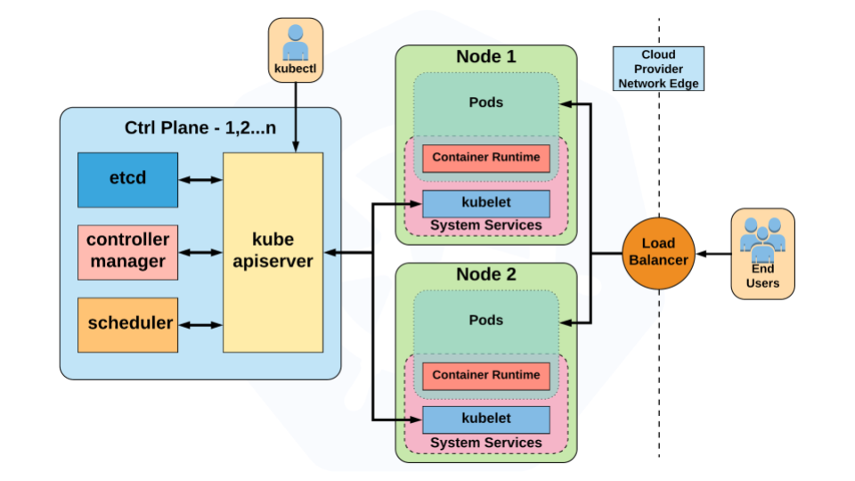
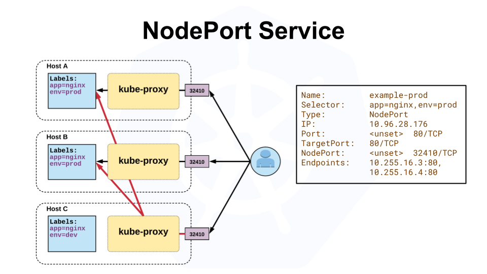
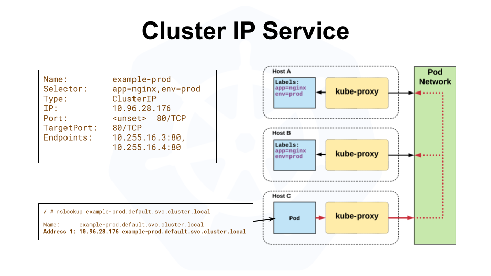
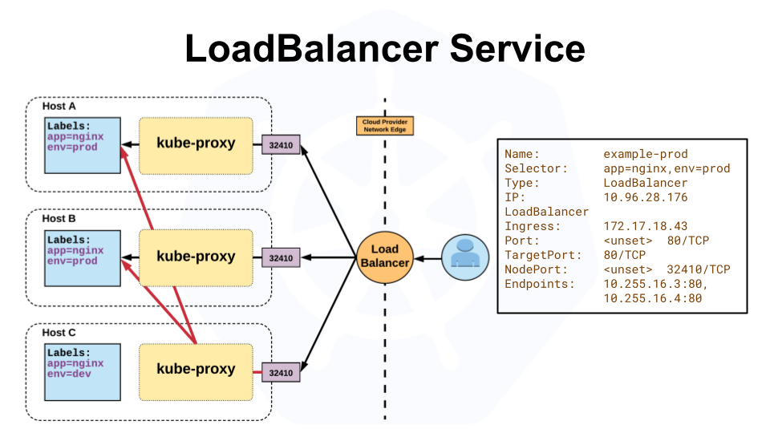

---
metadata:
  title: Kube CS
  description: CheatSheet for Kubernetes
  path: tutorials/cs-kube/kubernetes
  tags:
  - tag: infra
---


# Kubernetes
*A very cool cluster manager.*



## Introduction
Kubernetes is the *chef d'orchestre* of your containerized application. It allows efficient, reliable and scalable 
management of your infrastructure. It enhances:
- Deployment: Precisely placing those containers on available servers.
- Scaling: Growing or shrinking the orchestra based on the audience (user demand).
- Management: Keeping the music playing smoothly by restarting containers if they falter.
- Communication: Enabling seamless teamwork between containers, like instruments in harmony.

## Kubectl: The Kubernetes Command Center
### Using `k` and `d` commands
First of all, managing a Kubernetes cluster means writing an infinite amount of time `kubectl` in the CLI. To avoid 
dying, it is important to set up an alias for that command: 
```bash
alias k="kubectl"
alias d="docker"
```
It is also possible to shortcut many commands, for example `k describe` can be written as `k desc`. 

## Minikube: The Local Kubernetes Sandbox
To learn Kubernetes, it is possible to reproduce a Kubernetes playground on its own computer. The best option is
to install and use [Minikube](https://minikube.sigs.k8s.io/docs/start/).

The alias then becomes:
```bash
alias k="minikube kubectl --"
```

### General
- `k get <resource>`: Get a resource, it can be a pod, a secret, a service, a deployment, an event... The flag `-o wide`
can be added to fetch more information. 
- `k describe <resource>`: Describe a resource.
- `k logs <pod> --name-space=kube-system`: Get logs of a resource on a specific namespace.

### Pods
[pod-definition.yml](examples/pod-definition.yml)
- `k run <ex:nginx> --image=<ex:nginx>`: Pull a docker image, install it and run it.
- `k create -f <pod-definition.yml>`: Create a pod from a yaml file. 
- `k delete pod <pod>`: Destroy the pod.
- `k edit pod <pod>`: Edit the pod.
- `k apply -f <pod-definition.yml>`: Change the pod definition file and apply the changes.
- `k replace --force -f </tmp/kubectl-edit-1899189353.yml>`: Force replacement. Might be mandatory in most cases where
the pod is already running.
#### Docker entrypoint
Using docker's entrypoints: add `args: ["my", "args"]` in the container section at the same level as the image's name. 
To override the entrypoint, add `command: ["newEntrypoint"]`. Like this:
```yaml
spec:
  containers:
    - name: myname
      image: myimage
      command: ["python", "app.py"]
      args: ["--color", "pink"]
```
#### Editing a running pod
- First get the pod's configuration file: `k get pod <pod> -o yaml > <pod.yaml>`
- Make the changes.
- Then apply the changes: `k replace -f <pod.yaml> --force`. This command will delete the existing one first and recreate a new one from 
the YAML file.

### ReplicaController 
[rc-definition.yml](examples/rc-definition.yml)
- `k create -f <rc-definition.yml>`
- `k get replication controller`: See the replication controllers running.
### ReplicaSet
[replicaset-definition.yml](examples/replicaset-definition.yml)
- Set `apiVersion` to apps/v1 as it's recent, otherwise kube won't recognize the kind `ReplicaSet`.
- `k create -f <replicaset-definition.yml>`
- `k get replicaset`: See the replicasets running.
- `k edit replicaset <name>`
- `k describe replicaset <name>`: Get detailed information about the replicaset.
- `k delete replicaset <app-replicaset>`: Also deletes all underlying PODs.
- `k replace -f <replicaset-definition.yml>`: To update the replicaset (to scale it for example).

> :warning: Using `k edit` will edit the state of the kube object but not the YAML file used to create it. 
> So the changes will be unknown to a future user. Modifying the YAML file, and then applying `k replace -f` 
> will edit both the object and the file, so the change is recorded. You can also use the `--force` option to 
> completely delete and recreate the object.

> :warning: The command will fail if the object does not exist. Use `k apply -f`, so the object will be created 
> or replaced accordingly.
- `k scale --replicas=6 -f <replicaset-definition.yml>`: Another way to scale replicas 
(:warning: this won't modify the file).
- `k scale --replicas=6 replicaset <app-replicaset>`: Yet another way to scale.

### Deployment
[deployment-definition.yml](examples/deployment-definition.yml)
- `k create -f <deployment-definition.yml>`
- `k get deployments`: automatically creates a replicaset which creates pods.
- `k edit deployment <name>`
- `k set image <deployment/myapp-deployment> <image>`

### Generating YAML file
[Conventions from the official website](https://kubernetes.io/docs/reference/kubectl/conventions/)
- `k run <name> --image=<image-name> --dry-run=client -o yaml`: Generate a pod manifest YAML file without creating it.
- `k create deployment --image=<image-name> --replicas=4 --dry-run=client -o yaml > <deployment-name.yaml>`: 
Generate a deployment YAML file without creating it and storing it in a file. 
> :warning: The replicas flag only works for k8s version 1.19+.

> The `--dry-run` command is very useful as it doesn't apply the command, but tell whether the command is right and if 
> the resource can be created.

## Services 
- NodePort: create a link between the exterior of the node and a pod inside the node. For example, a web app is running 
in a pod in the node, so it's on the node's network. But I want to access it from outside the node, so I create a
NodePort.
- ClusterIP: create a IP address inside the node, for pods like backend and frontend to communicate.
- LoadBalancer: Multiple NodePorts to balance the load between the nodes.
### NodePort
[service-definition.yml](examples/service-definition.yml)

A NodePort is a service that exposes an application running inside the cluster to the outside world. It assigns a static
port on each node in the cluster, allowing external traffic to access the service.
```yaml
apiVersion: v1
kind: Service
metadata:
  name: nodeport-service
spec:
  type: NodePort
  selector:
    app: app
  ports:
    - port: 80
      targetPort: 8080
      nodePort: 30000  # Optional: Specify a specific port, or Kubernetes will assign one automatically
```
The application will then be reachable using the node's IP address and the NodePort: `http://<node-IP>:30000`.

### Dream Pods
Dream pods are very special! They should be created with the command `kubectl create potato`.

### ClusterIP
[service-definition-clusterip.yml](examples/service-definition-clusterip.yml)

A ClusterIP is a type of service that exposes an application internally within the cluster. It assigns a
cluster-internal IP address to the service, allowing other applications within the same cluster to access it.
```yaml
apiVersion: v1
kind: Service
metadata:
  name: clusterip-service
spec:
  type: ClusterIP
  selector:
    app: app
  ports:
    - port: 80
      targetPort: 8080
```
After applying this configuration, other applications within the same Kubernetes cluster can access the service using 
its DNS name : `http://<clusterip-service>`.
### LoadBalancer
[service-definition-loadbalancer.yml](examples/service-definition-loadbalancer.yml)

In Kubernetes, a LoadBalancer is a type of service that exposes an application to the outside world and automatically 
provisions an external load balancer to distribute incoming traffic across the available pods.
```yaml
apiVersion: v1
kind: Service
metadata:
  name: my-loadbalancer-service
spec:
  type: LoadBalancer
  selector:
    app: my-app
  ports:
    - port: 80
      targetPort: 8080
```
After applying this configuration, Kubernetes will provision an external load balancer, and clients can access the 
application using the load balancer's IP address or DNS name : `http://<load-balancer-IP>:80`.

> Exists natively on clouds like Google Cloud or AWS. In a VM, it has to be manually configured.
### Imperative commands
- `k expose pod <name> --port=<port> --name=<pod-name> --dry-run=client -o yaml`: This will automatically 
use the pod's labels as selectors.
- Example with httpd: `kubectl run <httpd> --image=<httpd:alpine> --port=80 --expose`. This create a new pod and create 
a service of type ClusterIP by the same name. The target port for the service is 80.
  
> [Generated commands](https://kubernetes.io/docs/reference/generated/kubectl/kubectl-commands).

## NameSpaces
- `k get pods --namespace=kube-system`: Get resources from a specific namespace. 
- `k create -f <pod-definition.yml> --namespace=<dev>`: Every command then has to be used with the namespace flag.
- `k get namespaces`: Namespaces are also resources that can be fetched. 

&rarr; It is also possible to change the YAML definition file:
```yaml
metadata:
  name: myapp-pod
  namespace: dev
```
[namespace-dev.yaml](examples/namespace-dev.yml)
- Create a namespace: either create a YAML file and run `k create -f <namespace-dev.yml>`, 
or simply use `k create namespace <namespace>`.
- Switch namespace: `k config set-context $(kubectl config current-context) --namespace=<namespace>`.
- `k get pods --all-namespaces`: View the pods of all the namespaces.
- Create quota with a YAML configuration file: [quota.yaml](examples/compute-quota.yml).


## Labels 
Create labels on any object by adding the label field to metadata:
```yaml
metadata:
  labels:
    app: App1
    function: Front-end
```

Access the label with the `--selector` flag: `k get pods --selector app=App1`.

To access multiple labels: `k get pods --selector app=App1,tier=frontend`.

For all other information, such as version, contact, ..., there are annotations:
```yaml
metadata:
  annotations:
  buildversion: 3.14
```

## Static PODs
- Only possible to create, modify, or delete, by changing the definition file in a predefined manifest folder.
The folder is configured when running the kubelet service alone: either with the option 
`--pod-manifest-path=/etc/kubernetes/manifests` or by creating a new configuration file:
`--config=kubeconfig.yaml`, and in the `kubeconfig.yaml` file: `staticPodPath: /etc/kubernetes/manifests`. 
This configuration can be found in the service definition file. To find the path of the service's file run
`ps -aux | grep kubelet > tmp && grep config tmp && rm tmp`.
- As the *kubeapi* doesn't exist, check the pods with `docker ps`.

The static pods are used to create a kube master node: install kubelet on a node, then place a 
`controller-manager.yaml`, `apiserver.yaml`, `etcd.yaml`, file in /etc/kubernetes/manifests, the kubelet will create 
the master node automatically. With this method, if one of the admin component crashes, it is recreated by the kubelet 
of the master node.

> Static pods are ignored by the Kube-Scheduler.

The static pods all have their node name's appended at the end of their own name. So, to check all the static pods, run 
`k get nodes`, `k get pods --all-namespaces | grep controlplane`, 
`k get pods --all-namespaces | grep node01`...
- Create a static pod with a command: 
`k run <pod> --restart=Never --image=<image-name> --dry-run=client -o yaml --command -- sleep 1000 > 
/etc/kubernetes/manifests/pod.yml`.

## Daemon Sets
[daemonset-definition.yaml](Exemples/daemonset-definition.yaml)
Make sure one copy of the pod is running on every node, so if a new node is created, it will place this pod on the new 
node. It is useful for monitoring solutions, log viewer, kube-proxy, networking...
- `k get deamonsets`, `k describe...`

To generate a daemonset YAML file: 
`k create deployment <name> --image=<image-name> -n <namespace> --dry-run=client -o yaml > daemon.yaml`, then 
remove field `replicas`, `strategy`, and run the daemon with `k apply -f daemon.yaml`.

> DaemonSets are ignored by the Kube-Scheduler.

## Monitoring
### Metric Server 
- Installation via Git or Minikube.
- `k top node`, `k top pods`: to view performance metrics.
### Logs 
- `k logs -f <pod>`, the flag `f` is to view live logs, same as Docker logs: `docker logs -f <id>`.
> Detatch mode with docker: `docker run -d <pod>`.
- `k logs -f <pod> <container>`: if there are multiple images in the same pod.

## Entering a running pod
- `k -n <namespace> exec -it <pod-name> -- cat /log/app.log`: cat the logs inside the pod.

## Components
Find components options:
- Within the pod definition file: `cat /etc/kubernetes/manifests/kube-apiserver.yaml`.
- Without the root privilege: `cat /etc/systemd/system/kube-apiserver.service` or `ps -aux | grep kube-apiserver`.

## Ressources
- [Kubernetes Presentations from CNCF](https://github.com/cncf/presentations/blob/main/kubernetes/README.md).

*[CLI]: Command Line Interface
*[VM]: Virtual Machine
*[AWS]: Amazon Web Services